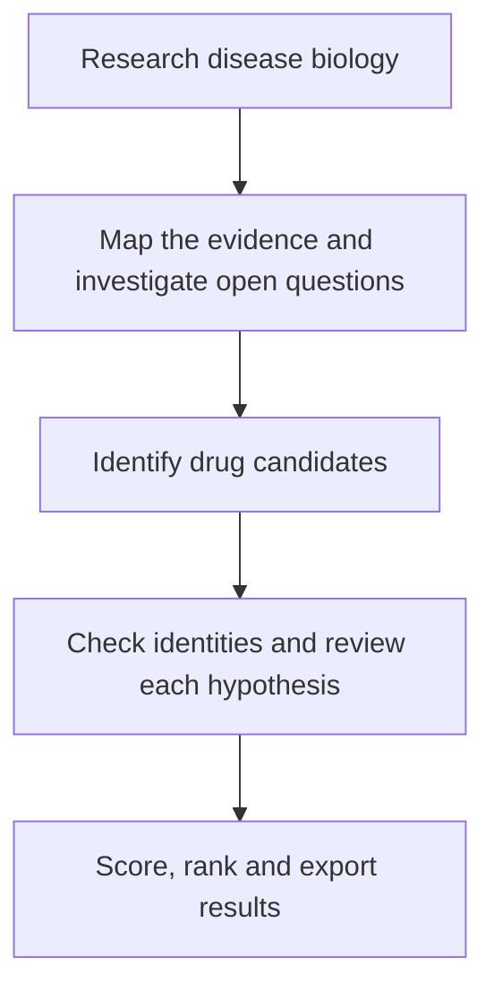

# Repurposing Research Program

[](https://github.com/Jaedki/repurposing-research-program/actions/workflows/test.yml)

An AI research workflow for finding and prioritising drug repurposing hypotheses for genetic diseases.

Give it a disease and, optionally, a gene. It researches the underlying biology, identifies existing drugs whose known actions could address specific disease mechanisms, and produces ranked candidates with cited evidence and limitations.

Currently optimised for GPT models in OpenAI Codex and packaged as a [Codex skill](SKILL.md). AI agents carry out the research; Python manages the workflow, validates results, and calculates the final rankings.

**For research use.** Outputs are experimental hypotheses, not clinical advice or evidence that a treatment works.

## How it works



Disease biology is researched before drugs are considered. The evidence map is fixed before candidate generation, and each hypothesis links evidence about the disease to separate evidence about a drug's action. A previous publication connecting that drug to the disease is not required.

## Getting started

You'll need Codex with subagents, local file and command access, and web research enabled; Python (automated tests use 3.14); and connected **Asta and Undermind MCP services**. Configure Asta with `ASTA_AI2_API_KEY` in the MCP host and connect an Undermind account with workspace and search access. These services are required for the literature discovery stages. See [source setup details](references/source-adapters.md).

1. Ask Codex to install the skill:

   ```text
   Use $skill-installer to install https://github.com/Jaedki/repurposing-research-program (the skill is at the repository root).
   ```

2. Install the Python dependency from the installed skill folder:

   ```sh
   python -m pip install -r requirements.txt
   ```

3. Start a research run in Codex:

   ```text
   Use $repurposing-research-program for Mitchell syndrome (ACOX1). Save the run in runs/mitchell-syndrome.
   ```

Replace the disease and gene with your own case. Codex needs network access to the literature services and scientific databases listed in the [source documentation](references/source-adapters.md). If the installed skill does not appear, restart Codex; see the [Codex skills guide](https://developers.openai.com/codex/skills/).

## Example: Mitchell syndrome (ACOX1)

The included run retained **169 sources**, researched **13 disease concepts**, and produced **15 ranked candidates** plus **1 audited exclusion**. Five of ten open pathology questions remained unresolved.

| Output | What you'll find |
| --- | --- |
| [Run summary](examples/mitchell-syndrome/outputs/summary.md) | Coverage, candidate counts and remaining gaps |
| [Ranked candidates](examples/mitchell-syndrome/outputs/candidates.csv) | Scores, scoring reasons and hypothesis reports |
| [Evidence cards](examples/mitchell-syndrome/outputs/candidate_cards.md) | Each candidate's rationale, cited evidence and limitations |
| [Exclusions](examples/mitchell-syndrome/outputs/candidate_exclusions.csv) | Candidates excluded during the final audit and why |

Completed runs save these files in their `outputs/` folder. Rankings help prioritise further investigation; they do not estimate treatment effectiveness.

For implementation details, see the [workflow instructions](SKILL.md) and [architecture](references/architecture.md).

## Licence

Copyright © 2026 Jaedki. The original repository content is licensed under the [Apache License 2.0](LICENSE). Third-party evidence and database content retain their original rights and licences; see [THIRD_PARTY_NOTICES.md](THIRD_PARTY_NOTICES.md).
